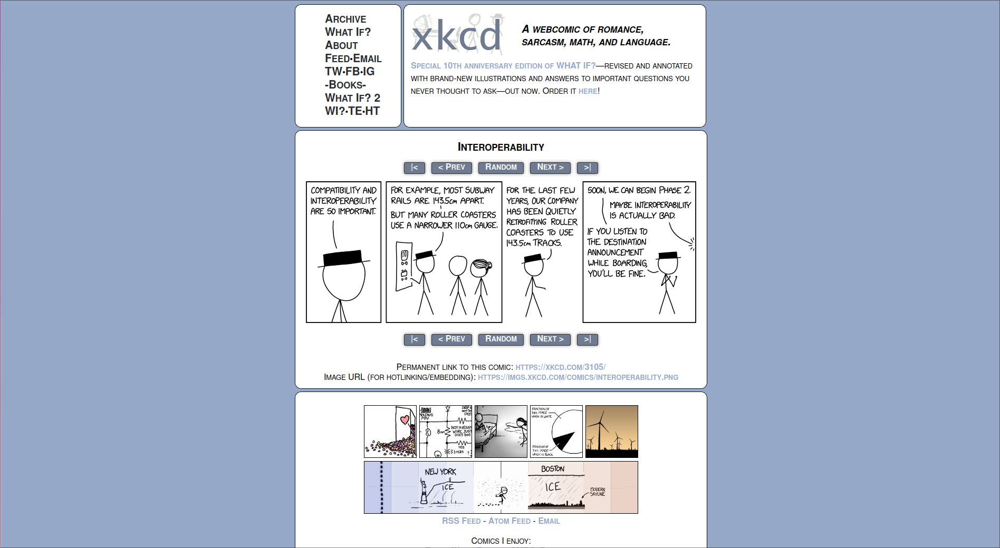
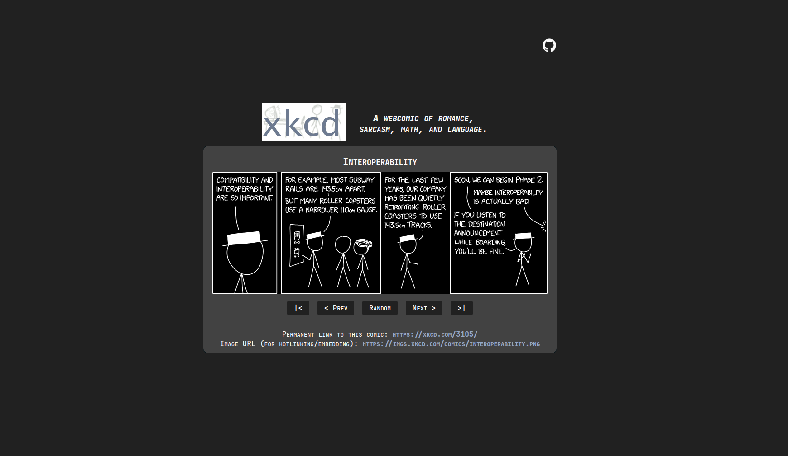

# xkcd Dark Minimalist Userscript
  
## Screenshots

| Original | Modified (Dark Minimalist) |
|----------|---------------------------|
|  |  |

A simple userscript that transforms [xkcd.com](https://xkcd.com) into a dark-themed, minimalist experience.

## Features

- Dark theme for comfortable reading at night
- Minimalist layout: removes distractions and focuses on the comic
- Lightweight and easy to use

## Installation

1. Install a userscript manager ([Violentmonkey](https://violentmonkey.github.io/) recommended).
2. [Download the script](./userscript.user.js) or copy its contents.
3. Add the script to your userscript manager.

## Usage

Just visit [xkcd.com](https://xkcd.com) — the script will automatically apply the dark minimalist style.

## License

MIT License

---

*This project is not affiliated with xkcd or Randall Munroe.*